= AWS Certification - Developer Associate 2021

[.lead]
*_This course includes Quarkus v2.x, Eclipse Vert.x 4.x, Apache Camel Quarkus v2.x and Terraform v1.x_*

IMPORTANT: *_Install JSON Viewers on Browser_*

IMPORTANT: *_Why we need Cloud?_*

- Considering an Online Shop App, with peak load during a black friday, but you have less load out this time, this mean waste resources in idle loads, company bought infrastructure to wait that such load, and the company falls in
1. Low infrastructure utilization
2. Needs ahead of time planning
3. High costs of procuring infrastructure
4. Dedicated infrastructure maintenance team

[.lead]
== AWS Secret Generation

[source,bash]
----
ssh-keygen -f {{PEM_FILE}}.pem
sudo ssh-keygen -e -m RFC4716 -f {{PEM_FILE}}.pem
sudo chmod 600 /path/{{PEM_FILE}}.pem
sudo chmod 755 /path_of_pems
ssh -i {{pem}} ec2-user@{{PUBLIC_IP}}
ssh -i {{pem}} ubuntu@{{PUBLIC_IP}}
----

[.lead]
== AWS ECR Quarkus push image using temp token in config

[source,bash]
----
mvn clean -DskipTests package -Pnative -Dquarkus.native.container-build=true
docker build -f src/main/docker/Dockerfile.native -t myapp .
aws ecr get-login-password --region sa-east-1
aws ecr get-login-password \
  --region sa-east-1 | docker login --username AWS --password-stdin \
  {{AWS_ACCOUNT_ID}}.dkr.ecr.sa-east-1.amazonaws.com
docker tag myapp {{AWS_ACCOUNT_ID}}.dkr.ecr.sa-east-1.amazonaws.com/aws-dev-repo:myapp

# docker run --rm --name myapp -p 8080:8080 myapp # only local test purpose - must be remove after test
docker push {{AWS_ACCOUNT_ID}}.dkr.ecr.sa-east-1.amazonaws.com/aws-dev-repo:myapp
----

== AWS ECR Login output

* The ##*_aws ecr get-login.._*## up command will generate the following message

[source,html]
----
WARNING! Your password will be stored unencrypted in {{YOUR_PATH}}/.docker/config.json.
Configure a credential helper to remove this warning. See
https://docs.docker.com/engine/reference/commandline/login/#credentials-store

Login Succeeded

----

[.lead]
- With the Cloud you buy (renting just needed Resources), and release it when not need them, On-demand resource provisioning offer low costs (pay per use)

- No upfront planning needed
- Avoiding "Undifferentiated heavy lifting"
- AWS provides most of 200+ services

NOTE: All links used as ref during this course and challenges

- https://aws.amazon.com/[AWS Cloud]
- https://{{YOUR_IAM_ID}}.signin.aws.amazon.com/console[IAM User AWS Console]
- https://camel.apache.org/[Apache Camel]
- https://camel.apache.org/camel-quarkus/latest/[Apache Camel Extensions for Quarkus]
- https://quarkus.io/[Quarkus]
- https://quarkus.io/guides/building-native-image[Building a Native Executable]
- https://code.quarkus.io/[Quarkus Coding]
- https://docs.asciidoctor.org/asciidoc/latest/syntax-quick-reference/#links[Asciidoctor Docs]
- https://www.pgadmin.org/download/pgadmin-4-apt/[pgAdmin4 APT]
- https://gmusumeci.medium.com/how-to-deploy-aws-ecs-fargate-containers-step-by-step-using-terraform-545eeac743be[Deploy ECS Fargate Containers]
- https://github.com/duduribeiro/terraform_ecs_fargate_example[Terraform ECS Fargate]
- https://engineering.finleap.com/posts/2020-02-20-ecs-fargate-terraform/[ECS and Fargate Terraform]
- https://github.com/turnerlabs/terraform-ecs-fargate/tree/master/env/dev[ECS Template Fargate]
- https://github.com/DouglasGo8/terraform-udemy/tree/master/section-8[ECS EC2 Autoscaling]
- https://hands-on.cloud/terraform-recipe-managing-auto-scaling-groups-and-load-balancers/[Managing Auto Scaling Groups & Load Balancers]
- https://github.com/DouglasGo8/aws-cert-dev-udemy/blob/master/section04-asg:asg/autosale/main.tf[AWS Cert Dev]
- https://github.com/Einsteinish/Terraform-Turotials/tree/master/Docker-Nginx-ALB-3-Containers-in-Private-Subnets-with-Dynamic-ASG[Nginx with ASG]
- https://quarkus.io/guides/writing-native-applications-tips[Tips for writing native applications ]
- https://quarkus.io/guides/amazon-lambda-http[AWS Lambda with RestEasy, Undertow or Vert.x Web]
- https://aws.amazon.com/pt/blogs/aws-brasil/integracao-do-aws-lambda-com-o-quarkus/[Integração do AWS Lambda com o Quarkus]
- https://www.youtube.com/watch?v=geio38-zAdI[Quarkus #47: AWS Lambda]
- https://how-to.vertx.io/aws-native-image-lambda-howto/[AWS Native Image Lambda HowTo]
- https://docs.aws.amazon.com/lambda/latest/dg/lambda-java.html[Building Lambda functions with Java]
- https://sysgears.com/articles/moving-lambda-function-from-serverless-to-terraform/[Moving Lambda function from Serverless to Terraform]
#-# https://medium.com/@pra4mesh/aws-lambda-in-java-and-terraform-544da9102e37[AWS Lambda in Java and Terraform]
- https://adamtheautomator.com/terraform-aws-lambda/[Terraform and AWS Lambda? Yep. You Can do that.]
- https://github.com/nasa/cumulus/blob/master/example/cumulus-tf/lambdas.tf[Git Cumulus Terraform Lambda Code]
- https://camel.apache.org/components/3.12.x/aws2-ddb-component.html[AWS 2 DYNAMODB Apache Camel]
- https://medium.com/swlh/deploy-aws-lambda-and-dynamodb-using-terraform-6e04f62a3165[Deploy AWS Lambda and DynamoDB Using Terraform]
- https://www.youtube.com/watch?v=28Da0l0MFms[AWS Lambda: Java (Corretto 11) vs. JavaScript]
- https://filia-aleks.medium.com/aws-lambda-battle-2021-performance-comparison-for-all-languages-c1b441005fd1[AWS Lambda battle 2021: performance comparison for all languages (cold and warm start)]

TIP: All tips to find possible issues in IaC scripts

* All public subnets must have the property *_map_public_ip_on_launch_* as true

IMPORTANT: Section Challenges

****
* Application Load Balance with Quarkus/Camel using AWS Fargate/ECR/ALB and Terraform
* All resources in terraform were did merge with the links in links Sections
* All details can be found over ./terraform/
* Application Load Balance over ASG EC2 (No AMI Custom) in ECR with NGINX Reactjs Container
* Lambda using JVM/Native Image (GraalVM) with Quarkus/Apache Camel, API Gateway and DynamoDb over Terraform IaC, with only a GET method
****

== IAM Section

1. Root User -> IAM User in a group with permissions
2. Never ever use Root User to create or manage resources
3. As Root user type go to IAM console search and create a group and after the user, *_e.g. DevGroup_* and their policies -> *_e.g. DevUser_*, assign it to a group, provides *_Programmatic access & AWS Management Console Access_*

== Regions and Zones

1. AWS provides multiple zones classified as regions (20+) that means multiple data centers spread around the world us-east-1 is the most common region used, in general choose that region based on your users and data are located, with regulatory and security compliance needs

image::content/pic/RegionsAWS.png[]

== EC2 Fundamentals

* https://registry.terraform.io/providers/hashicorp/aws/latest/docs/resources/instance[Terraform aws_instance]
* EC2 Elastic Computer Cloud, represents rented virtual servers, virtual machines billed by second
* We can create and manage EC2 lifecycle of EC2 instances create load balancers and auto-scaling groups, EC2 have ephemeral volumes, but we can attach permanent storages on them
* The SSH connection bellow is exclusively to Ubuntu Instances, in that case for AMZ instance must be ec2-user@public_ip

[source,bash]
----
ssh -i {{PEM}}.file ubuntu@public_ip
ps up $pid
----

* Security Groups Rules for EC2 Instances
** Security groups are *default deny*, if no rules configured no outbound/inbound traffic is allowed
** Can specify *allow rules ONLY*
** Can configure *separate rules* for inbound and outbound traffic
** Can add/delete sg groups to EC2 instances at any time
** Traffic NOT explicitly allowed by sg *will not reach the EC2 instance any way*
** Security Groups are stateful
** Timeout over responses is a typically SGs problem
** Common inbound rules to Security Groups in image bellow

image::content/pic/UsedTo_SG_InOutBound_Rules.png[]

* There are 270+ instance across 40+ instance types for different workloads to optimized combination of compute(CPU, GPU), memory, disk (storage) and networking

* Classify a specification
** t2.micro
*** t - instance family
*** 2 - generation, improvements with each gen.
*** micro - size (nano < micro < small < medium < large < xlarge < ...) ##As sizes increases how much cpu/memory/storage/networking must increase proportionately##
*** Using metadata information over EC2 to get details about the instance (Runs the commands inside the EC2 Machine)

[source,bash]
----
sudo su
curl http:://169.254.169.254/latest/meta-data/
curl http:://169.254.169.254/latest/meta-data/ami-id
curl http:://169.254.169.254/latest/dynamic/instance-identity
----

*** Sample of using http:://169.254.169.254/latest/dynamic/instance-identity/document

image::content/pic/EC2_Metadata_Dynamic_Intance_identity_Document.png[]

*** *Terraform Sample to EC2 AMZ AMI using httpd Web Server* the curl command bellow is not recommended here just to Test

image::content/pic/View_Change_EC2_UserData.png[Change/View User Data on EC2 Instance]

[source,hcl-terraform]
----
resource "aws_instance" "aws-ec2-micro-instance" {
  ami                    = lookup(var.amis, var.region)
  instance_type          = "t2.micro"
  vpc_security_group_ids = ["${data.aws_security_group.allow-ssh.id}"]
  key_name               = aws_key_pair.key-pub.key_name
  user_data = <<EOF
    #!/bin/bash
    sudo su
    yum update -y
    yum -y install httpd.x86_64
    sudo systemctl enable httpd
    sudo systemctl start httpd
    curl -s http:://{IP_NUMBER}/latest/dynamic/instance-identity/document > /var/www/html/index.html
  EOF

  tags = {
    Name = "aws-ec2-micro-instance"
  }
}
----

* EC2 Rules for Public and Private IPs
** IP public are internet accessible
** IP private are just *internal*/corporate network access
** Cannot have two resources with the same public IP address
** Two different corporate nets can have resources with same private IP address
** All EC2 instances are assigned with IP private address
** Public IP creation in EC2 can be enabled for EC2 instances in public subnet
** When you *stop* an EC2 instance, public IP address will be lost, Public IPs are ephemeral, to keep the same ip we need to configure an elastic ip, but is not recommended practice
** Elastic IP can be switched to another EC2 instance *within the same region*, *_must be detached manually_* otherwise it won't be released, you are billed when an EIP (Elastic IP) address *_IS NOT ASSOCIATED_* with any EC2 instance
* Installing OS Patches and software using userdata at launch of EC2 instances *increase boot up* time with appropriated hardening image build
* https://registry.terraform.io/providers/hashicorp/aws/latest/docs/resources/launch_template#capacity-reservation-specification[AWS EC2 launch Template demo]
* AMis contains
** Root volume block storage
** Block device mapping for non-root volumes
** Can configure and share own AMIs
** AMIs are stores on S3
** Always backup your AMIs
** Below some Important scenarios to EC2

image::content/pic/EC2_important_Scenarios_pt1.png[]

image::content/pic/EC2_important_Scenarios_pt2.png[]

== AWS Elastic Load Balancing

* Is a High Available *Managed* AWS service that enables distributed traffic among ec2 instances in one or more AZs in a single region
* Auto scales to handle huge loads, it can be *PUBLIC* or *PRIVATE*
* Health checks to check route traffic to healthy instances

Classifying Transport Layers::

Network Layer:::
. IP (Internet Protocol) - Transfer Bytes, unreliable
Transport Layers:::
. TCP (Transmission Control) - Reliability > Performance
. TLS (Transport Layer Security) - Secure TCP
. UDP (User Datagram Protocol) - Performance > Reliability
Application Layer:::
. HTTP (Hypertext transfer protocol) - Stateless Request/Response Cycle
. HTTPs: Secure HTTP

====
----
Application Layer (Layer 7) - HTTP/HTTPS/SMTP
Most apps use this layer - Web Apps/REST API(HTTP/HTTPS), Email Servers(SMTP), File Transfers(FTP)
All these apps use TCP/TLS at network layer (for reliability)
----

----
Transport Layer (Layer 4) - TCP TLS UDP
Apps that needing high performance *directly* communicate at transport layer, gamming apps/live video streaming use UDP
----

----
Network Layer (Layer 3) - IP
----
====

> Three type of AWS ELB > > > *Classic Load Balancer* (Layer 4 and Layer 7) **deprecated** note recomended by AWS, with support TCP, SSL/TLS and HTTP/HTTP(S) over Layer 4/7 > > > *Application Load Balancer* (Layer 7) - new generation to supporting HTTP/HTTPS and advanced routing approaches > > > *Network Load Balancer* (Layer 4) - New generation supporting TCP/TLS and UDP

* Application Load Balancer

** Most Popular and frequently used ELB in AWS, support WebSockets and HTTP/HTTPs over Layer 7, with support all import lb feat, and *automatically* scales based on demand
** Can load balance between
. EC2 Instances
. Containerized apps (Amazon ECS)
. Web apps (using IP address)
. Lambda can be used too, but is no used frequently most common approach in lambda is API Gateway
** Target Groups
. We can group instances to alb have distributed the load, can be a set of EC2 instances, lambda function or a set of ip address
** Stickyness is a feat to send all request from one user to the same instance is implemented by using a cookie
** Inbound Rules for SG can bind with the ALB security group to restrict http traffic as pic bellow

image::content/pic/ALB_SG_RESTRICT_AND_BIND.png[]

** Target Group and Listeners
. Listener checks for the connection requests, but each Load Balancer can have *one or more listeners* listening for connection request for the client
. Each listener has: protocol a port and a set of rules to route requests to targets

image::content/pic/ALB_Multiple_Listeners.png[]

. Target Groups exists to group instances that ALB must to distribute the load between the service/instances in terraform you bind the alb listener to alb target group
. Multiple Target Groups - In a microservices architecture we can have thousands of services spread out in our aws account, so we need multiple ALBs?
*_NOPE_* ALB can support multiple microservices instances creating a separate target group for each microservices, below a hcl-terraform snippet to explain this, *_Classic Load Balancer Not Support multiple target groups_*
. Rules are executed in the order they are configured
. We can create rules based on *_path_* (http(s)://somehost/path_for_service_a), based on *_host_* (http(s)://somehost)/ based on headers (http(s)) and Query Strings (http(s)://somehost?target=a), based on IP Address (all request coming from a specific address)
. In summary we have a highly decoupled architecture, ALB ca have multiple listeners and each listener have multiple rules routing to a target group

image::content/pic/ALB_Multiple_target_groups.png[]

image::content/pic/ALB_Listener_Rules.png[]

https://registry.terraform.io/providers/hashicorp/aws/latest/docs/resources/lb_listener_rule[Resource: aws_lb_listener_rule]

[source,hcl-terraform]
====
    resource "aws_lb_listener_rule" "my_listener_rule" {
      listener_arn = aws_lb_listener.my-lb-listener.arn
      priority     = 100
      action {
        type = "forward"
        target_group_arn = aws_lb_target_group.my-tg.arn
      }
      condition {
        path_pattern {
            values = ["/my-microservices-x/*"]
        }
      }
    }
====

. Possibilities are by path/host/headers/Query Strings(?target=x)/IP Address

== AWS Auto Scaling Groups

* Target groups are configured with static set of instances to scale out (when loads increase) and scale in (when the pick of loads stop and instances became idle) automatically, we can achieve this config using *_auto scaling groups_*
* ASG can launch On-Demand instances, Spot Intance or both, to do this as best practice use Launch Template, in terraform we can use *_aws_launch_template_* as demonstred bellow, more details in ./terraform/asg-httpd|asg-nginx-reactjs

[source,hcl-terraform]
----
resource "aws_launch_template" "nginx-launch-template" {
  name_prefix                          = "nginx-launch-template"
  image_id                             = data.aws_ami.ubuntu.id
  instance_type                        = var.AMZ_INSTANCE_TYPE
  key_name                             = aws_key_pair.key-pub.key_name
  user_data                            = filebase64("./reactjsapp.sh")
  vpc_security_group_ids               = [aws_security_group.sg-allow-http.id]
  instance_initiated_shutdown_behavior = "terminate"

  lifecycle {
    create_before_destroy = true
  }

  iam_instance_profile {
    name = aws_iam_instance_profile.ec2_ecr_iam_inst_profile.name
    #arn = aws_iam_role.ec2-ecr-role.arn
  }
}

resource "aws_autoscaling_group" "nginx-asg" {
  name             = "nginx-asg"
  min_size         = 1
  max_size         = 3
  desired_capacity = 2
  force_delete     = true

  # To test effect
  vpc_zone_identifier = [
    data.aws_subnet.main-public-1.id,
    data.aws_subnet.main-public-2.id,
    data.aws_subnet.main-public-3.id
  ]
  target_group_arns         = [aws_lb_target_group.alb-tg-nginx.arn]
  health_check_grace_period = 120
  health_check_type         = "ELB"
  enabled_metrics = [
    "GroupMinSize",
    "GroupMaxSize",
    "GroupDesiredCapacity",
    "GroupInServiceInstances",
    "GroupTotalInstances"
  ]
  launch_template {
    id      = aws_launch_template.nginx-launch-template.id
    version = "$Latest"
  }
  tag {
    key                 = "Name"
    value               = "EC2 Micro Instance"
    propagate_at_launch = true
  }

}
----

* Auto Scaling Components
. Launch Configuration/Template as EC2 AMIS Customs sizes etc
. Auto Scaling Group with min max size of this group and health checks
. Auto Scaling policies when and how to execute scaling
. Some policies to scaling with ASG

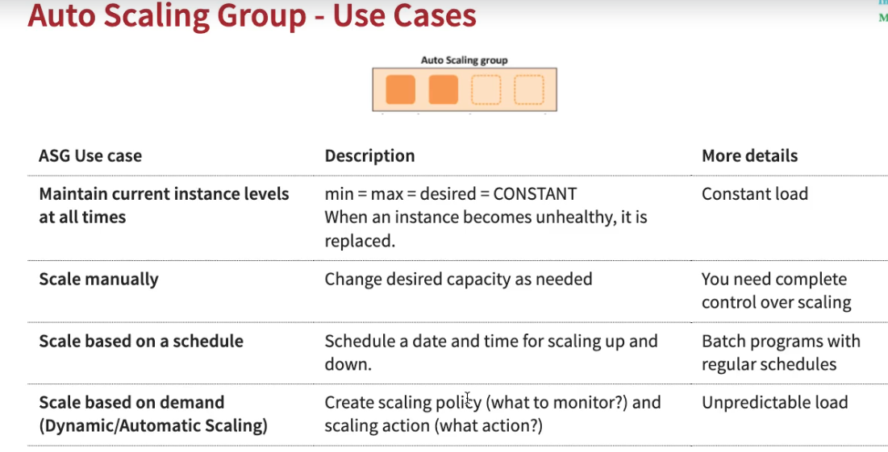

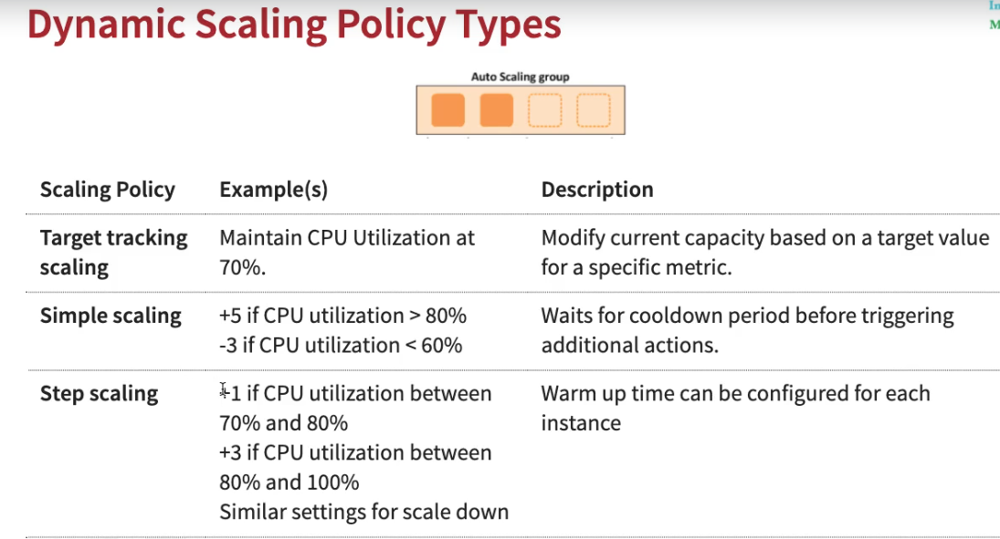

* Network Load Balancer Terraform sample

[source,hcl-terraform]
----
resource "aws_lb" "alb-nginx" {
  name               = "alb-nginx"
  internal           = false
  load_balancer_type = "network"
  subnets            = var.AMZ_SUBNETS
  security_groups    = [aws_security_group.sg-allow-lb-http.id]

  tags = {
    Name = "alb-nginx"
  }

}

resource "aws_lb_listener" "alb-listener-nginx" {
  load_balancer_arn = aws_lb.alb-nginx.arn
  port              = 80
  protocol          = "TCP"
  default_action {
    type             = "forward"
    target_group_arn = aws_lb_target_group.alb-tg-nginx.arn
  }
}

resource "aws_lb_target_group" "alb-tg-nginx" {
  name        = "alb-tg-nginx"
  port        = 80
  protocol    = "TCP"
  target_type = "instance"
  vpc_id      = var.VPC_ID

  health_check {
    port                = 80
    interval            = 10
    path                = "/"
    protocol            = "TCP"
    timeout             = 5
    healthy_threshold   = 5
    unhealthy_threshold = 5
  }
}
----

== Serverless Architecture Pt1

IMPORTANT: Serverless *does NOT mean* "No Servers"

* Serverless means - No worry about Infrastructure, flexible scaling, automated high available, pay for use
* With Serverless you can keep focus over the code
* Some kind serverless Apps in AWS - Fargate, Lambda, API Gateway, Cognito, DynamoDB

=== AWS Serverless Lambda

* Run your code without thinking about Servers, (but stay locked in AWS =) full vendor control)
* AWS Lambda is the most popular choice in AWS, only about worry your code
* ##Pay of number of requests, duration of requests and Memory##
* As a good practice is enabled X-Ray Traces
* To ensure that a critical lambda needs always run we need specify a reserved concurrency, e.g We can reserve up to 900 Instances to a specific lambda
* Lambda execution needs of a temporary runtime env, lambdas tries to reuse the execution context when possible, in the same execution context, object declares outside handler remain initialized, e.g Dynamodb
* AWS reserve /tmp with 512mb disk space as caching to be reused across invocations
* Cold start is a common problem for the first request to a lambda function is tied to the first request, to guarantee a consistent performance from lambda function we can use *_Provisioned Concurrency_*, but in this scenario we have a ##more expensive service##
* In Provisioned with reserved concurrency scenario, more instances can come than is allowed *_throttling_* concept can be applied, and the request will receive 429 status code
* Lambda can be invoked in both Sync/Async scenarios, in sync we have AWS API Gateway, CloudFront and Lex, to Async we have no wait for responses in aws services, we can Invoke as Task startTask over EC2 and runTask in a EC2/ECS service, we can send a SQS/SNS message when some event happens in S3, when a successful execution is done an invocation Record can be sent other message to SQS/SNS or another lambda function, but in case of fails there is a configuration options to async ops with retry, dlq and max age of event options
* A Lambda@Edge location (Cloudfront) can be used to invoke the lambda function, but have a restriction and can be used just with to Python or Node.js (Javascript)
* Alias can pointer to a specific version of lambda
* Lambda code is typically dependent on other libraries, using layers we can share libs among lambdas and the *size* of lambda can be reduced
* Sum up as best practices to use lambda we have, take advantage of *execution context reuse* to improve performance, initialize SDK clients and database connections outside of function handler, cache static assets locally in the /tmp dir *env variables* to pass operation parameters, *minimize your deployment package size as small possible*, avoid recursive code
* Summary and tips for AWS Lambda

.Tips to Questions 1
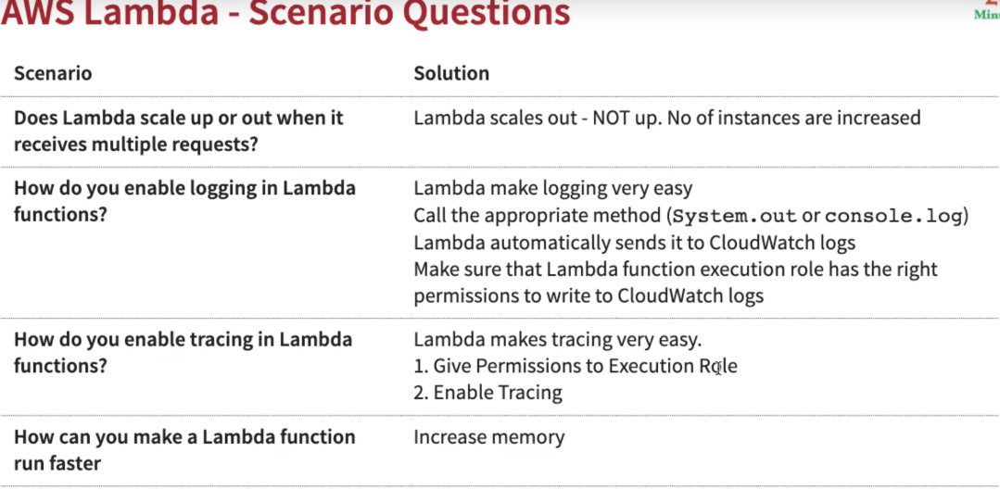

.Tips to Questions 2
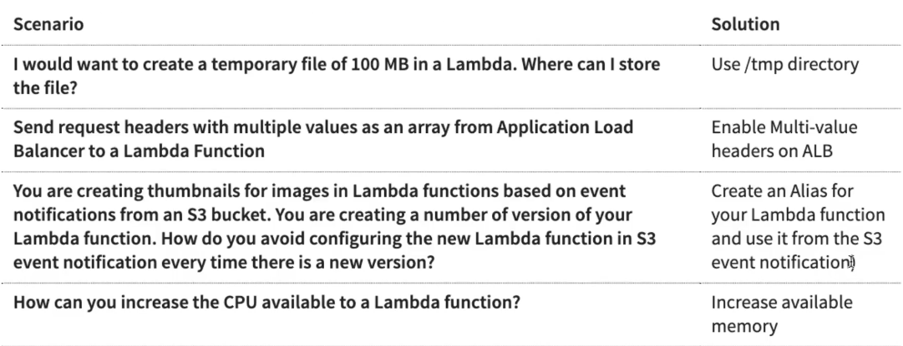

[source,javascript]
----
const AWS = require('aws-sdk'); // keeps initialized in the same context
const dynamo = new AWS.DynamoDB.DocumentClient();
exports.handler = async (event) => {
    // Other Logic
}
----

IMPORTANT: *_Note when using AWS Lambda with Camel Quarkus and Terraform_*

* When we are using Terraform to deploy your function.zip file to lambda structure the handler *MUST BE* ##io.quarkus.amazon.lambda.runtime.QuarkusStreamHandler::handleRequest## as Terraform Snippet bellow

[source,hcl-terraform]
----
resource "aws_lambda_function" "hello_lambda" {
  function_name    = var.AWS_LAMBDA_FUNCTION_NAME
  filename         = "${path.module}/function.zip"
  role             = aws_iam_role.hello_lambda_role.arn
  depends_on       = [aws_cloudwatch_log_group.hello_lambda_logging]
  runtime          = "java11"
  handler          = var.AWS_LAMBDA_HANDLER # pay attention here!!!
}

variable "AWS_LAMBDA_HANDLER" {
  default = "io.quarkus.amazon.lambda.runtime.QuarkusStreamHandler::handleRequest"
}
----

.First Execution Lambda using Node.js v12.x
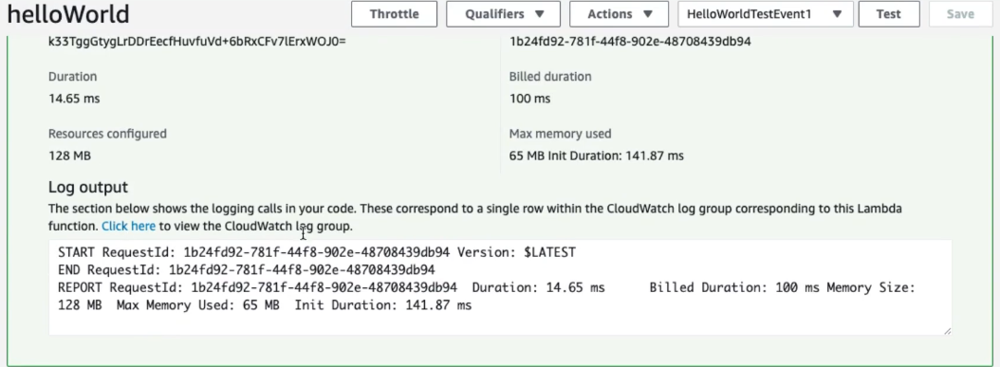

.X-Ray Enabled Lambda using Node.js v12.x
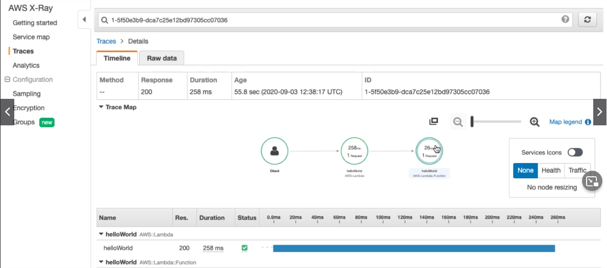

=== AWS API Gateway

* Based on Resources *_todos_*, *_todos/{id}_*
* Actions - HTTPS Methods - GET, PUT, POST, DELETE
* API Gateway can *_publish,maintain,monitor,and secure APIs at any scale_*, supports HTTP(s) and WebSockets (two-way communication - chat apps and streams dashboards)
* REST API
** Fully Featured (API Caching, Request/Response Validation, Test Invocations)
* HTTP API
** Newer, Simple cheaper and Low latency
** Automatic Deployments
* Integration Request/Response in API Gateway can be used to apply transformations in all requests/responses
** Terraform demonstration MOCK application/xml https://registry.terraform.io/providers/hashicorp/aws/latest/docs/resources/api_gateway_integration_response[API Gateway Integration Response]

[source,hcl-terraform]
----
resource "aws_api_gateway_integration_response" "MyDemoIntegrationResponse" {
  rest_api_id = aws_api_gateway_rest_api.MyDemoAPI.id
  resource_id = aws_api_gateway_resource.MyDemoResource.id
  http_method = aws_api_gateway_method.MyDemoMethod.http_method
  status_code = aws_api_gateway_method_response.response_200.status_code

  # Transforms the backend JSON response to XML
  response_templates = {
    "application/xml" = <<EOF
#set($inputRoot = $input.path('$'))
<?xml version="1.0" encoding="UTF-8"?>
<message>
    $inputRoot.body
</message>
EOF
  }
}
----

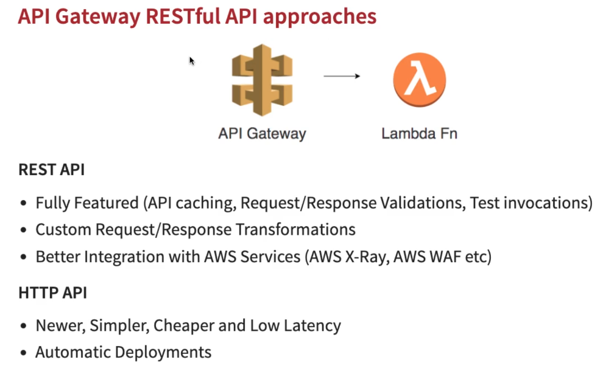

* We can customize all lifecycle in gateway, [Method Request (Auth, Header, etc.) - Integration Request, Integration Response Method Response]

.Sample of Response integration Screen in AWS API Gateway
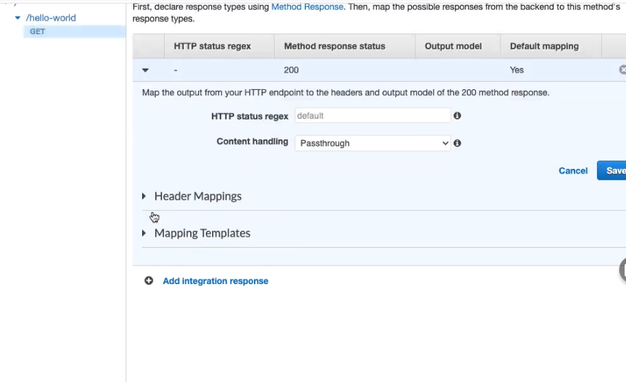

[source,hcl-terraform]
----
# Sample of Response integration Screen in AWS API Gateway using Terraform
----

.Sample of AWS API Gateway and Lambda Integration
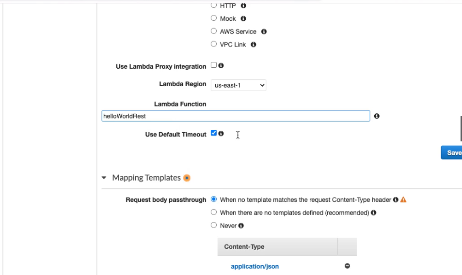

* With mapping templates we can customize all Requests sent to Lambdas using ##Method Request passthrough##

.Sample of Template "`Method Request pass through`"
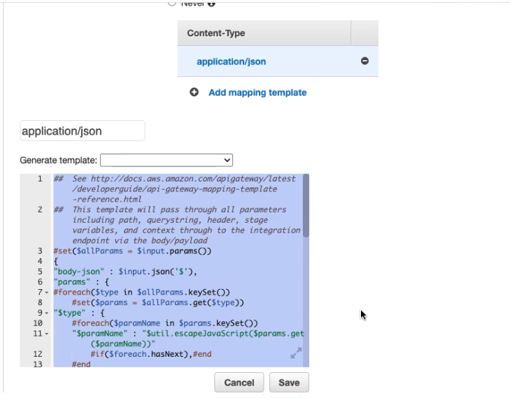

.Sample of Event details using Method Request pass through over Lambda Function
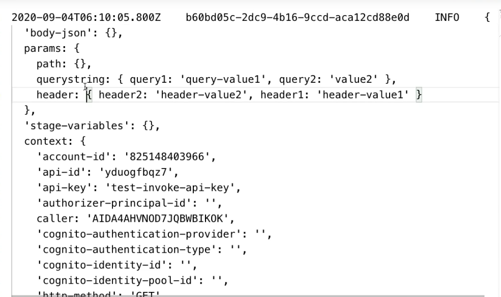

* JSON Schema validation https://json-schema.org/learn/getting-started-step-by-step.html[JSON Schema Validation]

.Sample of Validation Request Body with a Model Schema to Use over Request Body Model
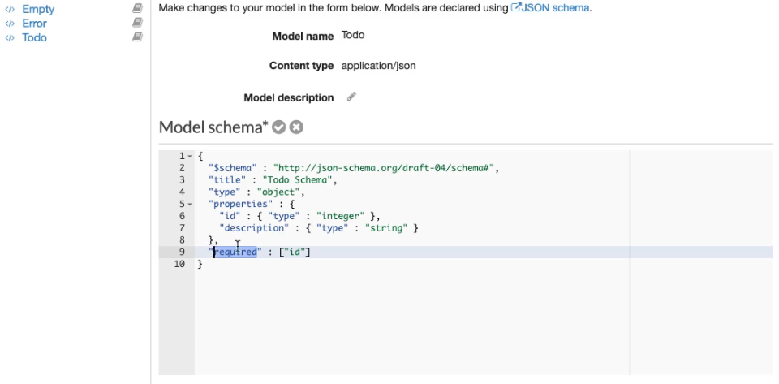

.Sample of Pre-defined Gateway Responses to BAD_REQUEST Sample
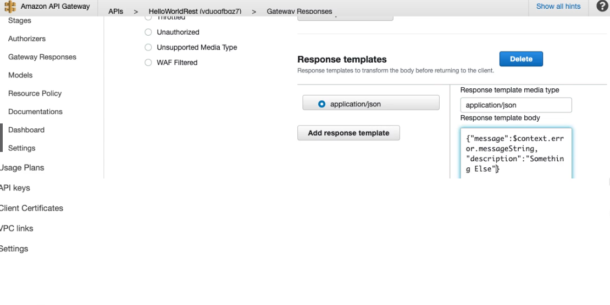

.Sample of a deploying a new Stage in AWS Gateway
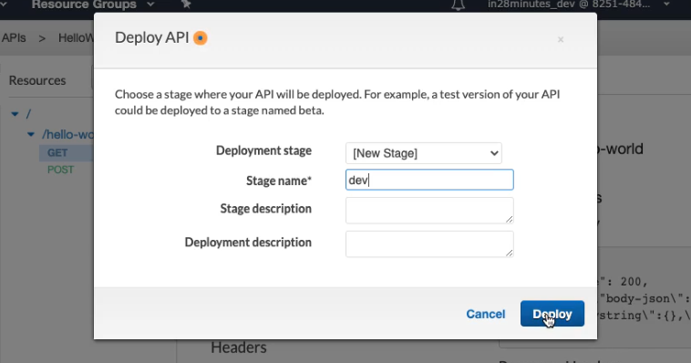

* HTTP API - API Gateway

.Snippet of Apache Camel and Quarkus Integration with DynamoDb
[source,java]
----
@NoArgsConstructor
@ApplicationScoped
public class MyRouter extends RouteBuilder {

  @Inject
  DynamoDbClient dbClient;

  @Override
  public void configure() {

    from("timer://myTimer?period=10s&fixedRate=true")
            .process(e -> {
              var key = new HashMap();
              key.put("Language", AttributeValue.builder().s("Java").build());
              e.getIn().setHeader(Ddb2Constants.KEY, key);
              //e.getIn().setHeader(Ddb2Constants.ATTRIBUTE_NAMES, key.keySet()); // comment to return all attributes table
            })
            .to("aws2-ddb://LanguageStatistic-table?operation=getItem")
            /*.process(e-> {

                var response =  (Map<String, AttributeValue>) e.getIn().getHeader(Ddb2Constants.ATTRIBUTES);
                e.getIn().setBody(response);

            })*/
            .to("bean:myBean")
            //.convertBodyTo(String.class)
            .log("${body}");
  }
}

@Named
@NoArgsConstructor
@ApplicationScoped
@RegisterForReflection
public class MyBean {

  @Handler
  public MyDto fromMyDto(final @Header(Ddb2Constants.ATTRIBUTES) Map<String, AttributeValue> myDynamoDbHeader) {
    var score = myDynamoDbHeader.get("Score").n();
    var language = myDynamoDbHeader.get("Language").s();
    return new MyDto(score, language);
  }

}
----

.Snippet of Terraform Custom Runtime AWS Lambda
[source,hcl-terraform]
----
resource "aws_lambda_function" "hello_lambda" {
  function_name    = var.AWS_LAMBDA_FUNCTION_NAME
  filename         = "${path.module}/function.zip"
  role             = aws_iam_role.hello_lambda_role.arn
  depends_on       = [aws_cloudwatch_log_group.hello_lambda_logging]
  runtime          = "provided" // Native execution using Java + GraalVM
  handler          = var.AWS_LAMBDA_HANDLER
  memory_size      = 128 // Native execution using Java + GraalVM
  source_code_hash = base64sha256("${path.module}/../../mp-lambda-quarkus/target/function.zip")
}
----

.AWS Lambda First Execution using Java Zulu OpenJDK 17 (Quarkus/Apache Camel/Dynamodb)
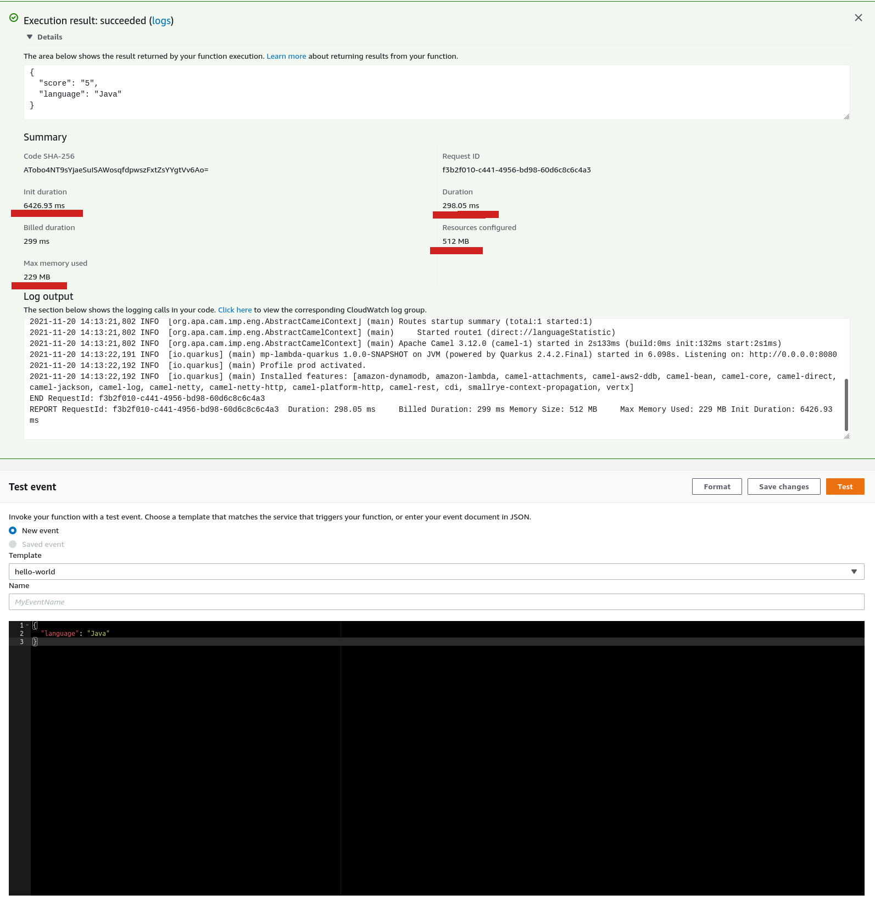

.AWS Lambda First Execution using GraalVM
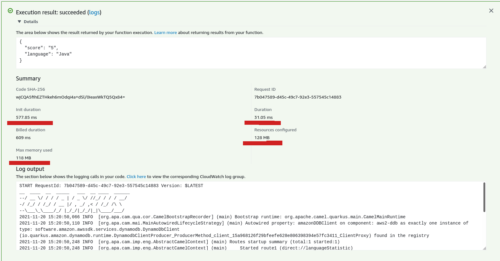

.AWS Lambda Nth Execution using GraalVM
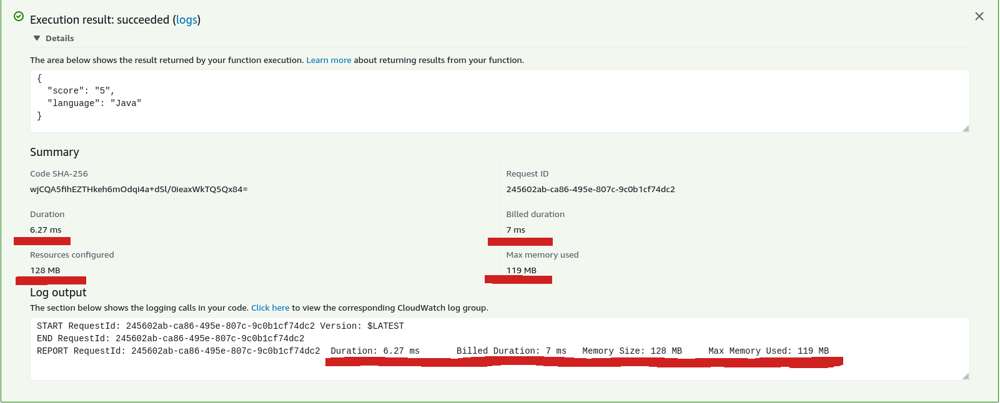

=== Identity Federation (AWS Cognito)

. What is? Authentication users with an external authentication system and provide them access to resources on the cloud
.. Corporate Identity - Federate with a Enterprise Auth System
... SAML (XML Based) is the most popular protocol
.. Web Identity Federation
... Provide access to your application to users based on their Social IDs
... OpenID (Supported by Facebook etc.) is the most popular protocol
.. With cognito we can quickly add a sign-up page and authentication for mobile and web apps, we can also integrate with web identity providers such Google, Facebook etc
.. Cognito is based in Identity Pools such Users Pools to create own secure scalable user dirs, sign-up or registration pages, customizable web ui to sign users, Cognito User Pool can be integrated with Api Gateway and Application Load Balancer

.Cognito Users Pool vs Identity Pool
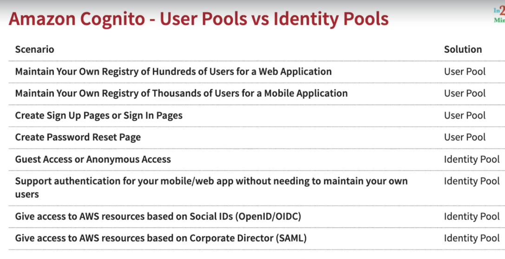