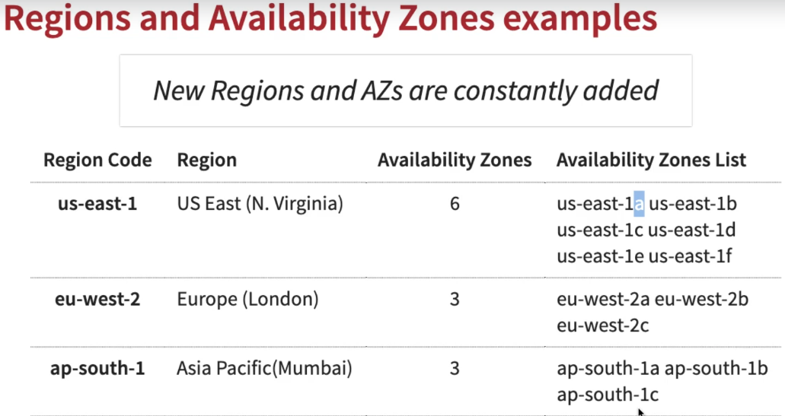
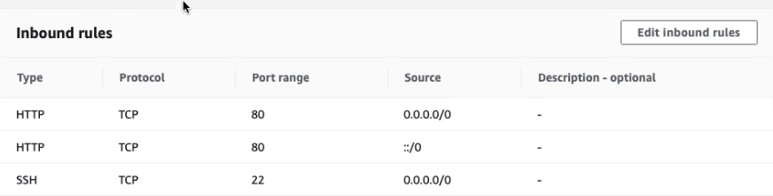
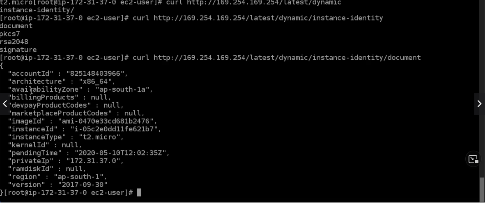
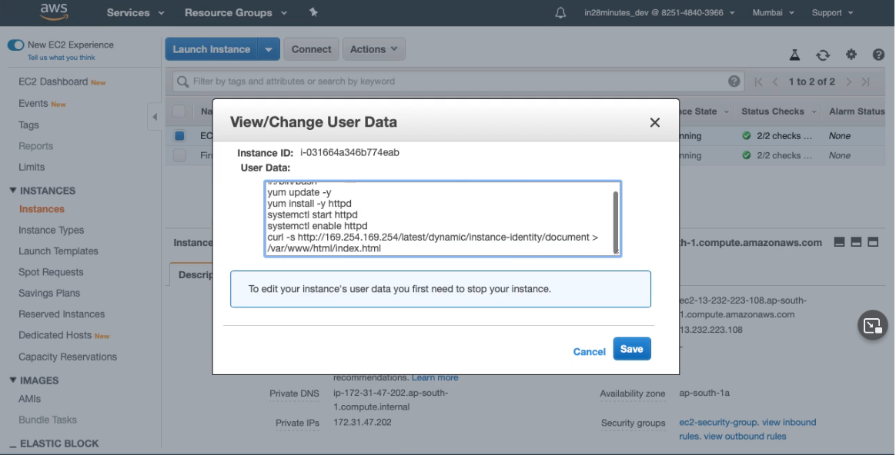
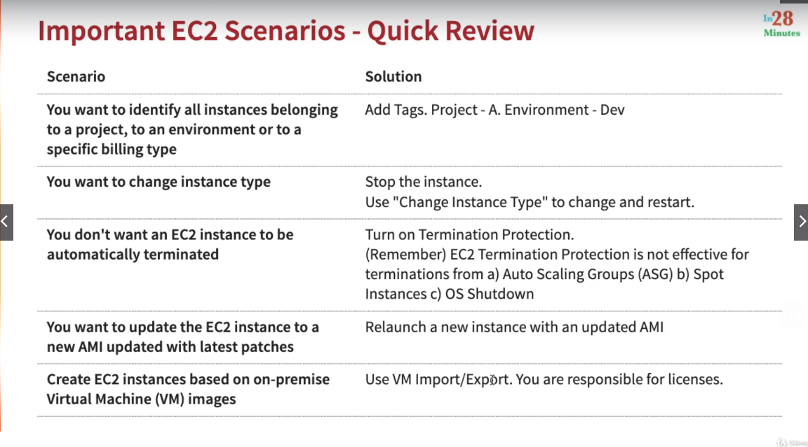
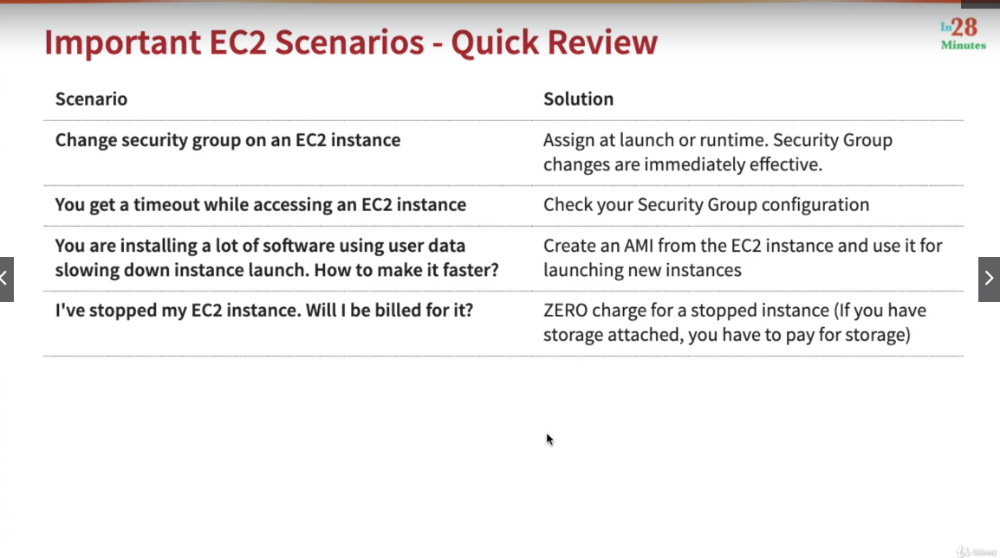
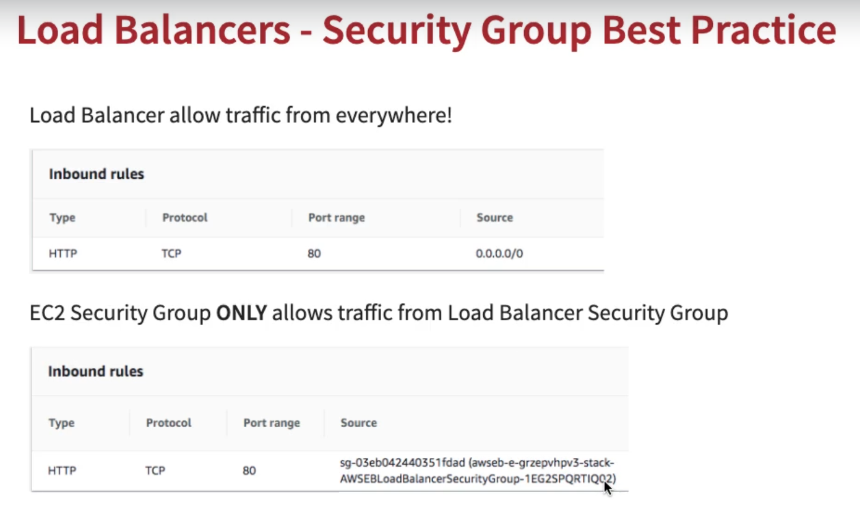
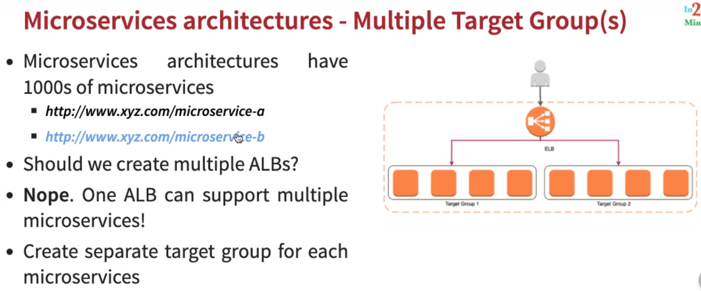
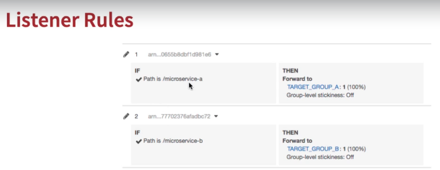

= AWS Certification - Developer Associate 2021

[.lead]

*_This course includes Quarkus v2.x, Apache Camel Quarkus v2.x and Terraform v1.x with all challenge details
founded over the Course_*

IMPORTANT: *_Install JSON Viewers on Browser_*

IMPORTANT: *_Why we need Cloud?_*

- Considering an Online Shop App, with peak load during a black friday, but you have less load out this time, this
mean waste resources in idle loads, company bought infrastructure to wait that such load, and the company falls in
1. Low infrastructure utilization
2. Needs ahead of time planning
3. High costs of procuring infrastructure
4. Dedicated infrastructure maintenance team

[.lead]
== AWS Secret Generation
[source,bash]
----
ssh-keygen -f {{PEM_FILE}}.pem
sudo ssh-keygen -e -m RFC4716 -f {{PEM_FILE}}.pem
sudo chmod 600 /path/{{PEM_FILE}}.pem
sudo chmod 755 /path_of_pems
ssh -i {{pem}} ec2-user@{{PUBLIC_IP}}
ssh -i {{pem}} ubuntu@{{PUBLIC_IP}}
----

[.lead]
== AWS ECR Quarkus push image using temp token in config

[source,bash]
----
mvn clean -DskipTests package -Pnative -Dquarkus.native.container-build=true
docker build -f src/main/docker/Dockerfile.native -t myapp .
aws ecr get-login-password --region sa-east-1
aws ecr get-login-password \
  --region sa-east-1 | docker login --username AWS --password-stdin \
  {{AWS_ACCOUNT_ID}}.dkr.ecr.sa-east-1.amazonaws.com
docker tag myapp {{AWS_ACCOUNT_ID}}.dkr.ecr.sa-east-1.amazonaws.com/aws-dev-repo:myapp

# docker run --rm --name myapp -p 8080:8080 myapp # only local test purpose - must be remove after test
docker push {{AWS_ACCOUNT_ID}}.dkr.ecr.sa-east-1.amazonaws.com/aws-dev-repo:myapp
----
== AWS ECR Login output

* The ##*_aws ecr get-login.._*## up command will genenerate the following message
[source, html]
----
WARNING! Your password will be stored unencrypted in {{YOUR_PATH}}/.docker/config.json.
Configure a credential helper to remove this warning. See
https://docs.docker.com/engine/reference/commandline/login/#credentials-store

Login Succeeded

----

[.lead]

- With the Cloud you buy (renting just needed Resources), and release it when not need them,
On-demand resource provisioning offer low costs (pay per use)
- No upfront planning needed
- Avoiding "Undifferentiated heavy lifting"
- AWS provides most of 200+ services

== The main Links

- https://aws.amazon.com/[AWS Cloud]
- https://{{YOUR_IAM_ID}}.signin.aws.amazon.com/console[IAM User AWS Console]
- https://camel.apache.org/[Apache Camel]
- https://camel.apache.org/camel-quarkus/latest/[Apache Camel Extensions for Quarkus]
- https://quarkus.io/[Quarkus]
- https://code.quarkus.io/[Quarkus Coding]
- https://docs.asciidoctor.org/asciidoc/latest/syntax-quick-reference/#links[Asciidoctor Docs]
- https://www.pgadmin.org/download/pgadmin-4-apt/[pgAdmin4 APT]
== IAM Section

1. Root User -> IAM User in a group with permissions
2. Never ever use Root User to create or manage resources
3. As Root user type go to IAM console search and create a group and after the user, *_e.g. DevGroup_* and their
policies -> *_e.g. DevUser_*, assign it to a  group, provides *_Programmatic access & AWS Management Console Access_*

== Regions and Zones

1. AWS provides multiple zones classified as regions (20+) that means multiple data centers spread around the world
us-east-1 is the most common region used, in general choose that region based on your users and data are located,
with regulatory and security compliance needs

== EC2 Fundamentals:: https://registry.terraform.io/providers/hashicorp/aws/latest/docs/resources/instance[Terraform aws_instance]

* EC2 Elastic Computer Cloud, represents rented virtual servers, virtual machines billed by second
* We can create and manage EC2 lifecycle of EC2 instances create load balancers and auto-scaling groups, EC2 have
ephemeral volumes, but we can attach permanent storages on them
* The SSH connection bellow is exclusively to Ubuntu Instances, in that case for AMZ instance must be ec2-user@public_ip

[source, bash]
----
ssh -i {{PEM}}.file ubuntu@public_ip
ps up $pid
----
* Security Groups Rules for EC2 Instances
** Security groups are *default deny*, if no rules configured no outbound/inbound traffic is allowed
** Can specify *allow rules ONLY*
** Can configure *separate rules* for inbound and outbound traffic
** Can add/delete sg groups to EC2 instances at any time
** Traffic NOT explicitly allowed by sg *will not reach the EC2 instance any way*
** Security Groups are stateful
** Timeout over responses is a typically SGs problem
** Common inbound rules to Security Groups in image bellow

* There are 270+ instance across 40+ instance types for different workloads to optimized combination of
compute(CPU, GPU), memory, disk (storage) and networking

* Classify a specification
** t2.micro
*** t - instance family
*** 2 - generation, improvements with each gen.
*** micro - size (nano < micro < small < medium < large < xlarge < ...)
##As sizes increases how much cpu/memory/storage/networking must increase proportionately##
*** Using metadata information over EC2 to get details about the instance (Runs the commands inside the EC2 Machine)
[source, bash]
----
sudo su
curl http:://169.254.169.254/latest/meta-data/
curl http:://169.254.169.254/latest/meta-data/ami-id
curl http:://169.254.169.254/latest/dynamic/instance-identity
----
*** Sample of using http:://169.254.169.254/latest/dynamic/instance-identity/document

*** *Terraform Sample to EC2 AMZ AMI using httpd Web Server* the curl command bellow is not recommended here just to Test

[source, hcl-terraform]
----
resource "aws_instance" "aws-ec2-micro-instance" {
  ami                    = lookup(var.amis, var.region)
  instance_type          = "t2.micro"
  vpc_security_group_ids = ["${data.aws_security_group.allow-ssh.id}"]
  key_name               = aws_key_pair.key-pub.key_name
  user_data = <<EOF
    #!/bin/bash
    sudo su
    yum update -y
    yum -y install httpd.x86_64
    sudo systemctl enable httpd
    sudo systemctl start httpd
    curl -s http:://{IP_NUMBER}/latest/dynamic/instance-identity/document > /var/www/html/index.html
  EOF

  tags = {
    Name = "aws-ec2-micro-instance"
  }
}
----

* EC2 Rules for Public and Private IPs
** IP public are internet accessible
** IP private are just *internal*/corporate network access
** Cannot have two resources with the same public IP address
** Two different corporate nets can have resources with same private IP address
** All EC2 instances are assigned with IP private address
** Public IP creation in EC2 can be enabled for EC2 instances in public subnet
** When you *stop* an EC2 instance, public IP address will be lost, Public IPs are ephemeral, to keep the same ip we need to
configure an elastic ip, but is not recommended practice
** Elastic IP can be switched to another EC2 instance *within the same region*, *_must be detached manually_* otherwise it
won't be released, you are billed when an EIP (Elastic IP) address *_IS NOT ASSOCIATED_* with any EC2 instance
* Installing OS Patches and software using userdata at launch of EC2 instances *increase boot up* time with appropriated
hardening image build
* https://registry.terraform.io/providers/hashicorp/aws/latest/docs/resources/launch_template#capacity-reservation-specification[AWS EC2 launch Template demo]
* AMis contains
** Root volume block storage
** Block device mapping for non-root volumes
** Can configure and share own AMIs
** AMIs are stores on S3
** Always backup your AMIs
** Below some Important scenarios to EC2

== AWS Elastic Load Balancing

* Is a High Available *Managed* AWS service that enables distributed traffic among ec2 instances in one or more AZs in a single region
* Auto scales to handle huge loads, it can be *PUBLIC* or *PRIVATE*
* Health checks to check route traffic to healthy instances

Classifing Transport Layers::

 Network Layer:::
   . IP (Internet Protocol) - Transfer Bytes, unreliable
 Transport Layers:::
   . TCP (Transmission Control) - Reliability > Performance
   . TLS (Transport Layer Security) - Secure TCP
   . UDP (User Datagram Protocol) - Performance > Reliability
 Application Layer:::
   . HTTP (Hypertext transfer protocol) - Stateless Request/Response Cycle
   . HTTPs: Secure HTTP

====
----
Application Layer (Layer 7) - HTTP/HTTPS/SMTP
Most apps use this layer - Web Apps/REST API(HTTP/HTTPS), Email Servers(SMTP), File Transfers(FTP)
All these apps use TCP/TLS at network layer (for reliability)
----
----
Transport Layer (Layer 4) - TCP TLS UDP
Apps that needing high performance *directly* communicate at transport layer, gamming apps/live video streaming use UDP
----
----
Network Layer (Layer 3) - IP
----
====

> Three type of AWS ELB
>
> > *Classic Load Balancer* (Layer 4 and Layer 7) **deprecated** note recomended by AWS, with support TCP, SSL/TLS and HTTP/HTTP(S) over Layer 4/7
>
> > *Application Load Balancer* (Layer 7) - new generation to supporting HTTP/HTTPS and advanced routing approaches
>
> > *Network Load Balancer* (Layer 4) - New generation supporting TCP/TLS and UDP

* Application Load Balancer

** Most Popular and frequently used ELB in AWS, support WebSockets and HTTP/HTTPs over Layer 7, with support all import lb feat, and *automatically* scales
based on demand
** Can load balance between
  . EC2 Instances
  . Containerized apps (Amazon ECS)
  . Web apps (using IP address)
  . Lambda can be used too, but is no used frequently most common approach in lambda is API Gateway
** Target Groups
  . We can group instances to alb have distributed the load, can be a set of EC2 instances, lambda function or a set of ip address
** Stickyness is a feat to send all request from one user to the same instance is implemented by using a cookie
** Inbound Rules for SG can bind with the ALB security group to restrict http traffic as pic bello

** Target Group and Listeners
 . Listener checks for the connection requests, but each Load Balancer can have *one or more listeners* listening for connection request for the client
 . Each listener has: protocol a port and a set of rules to route requests to targets

image::content/pic/ALB_Multiple_Listeners.png[]

 . Target Groups exists to group instances that ALB must to distribute the load between the service/instances in terraform you bind the alb listener to alb target group
 . Multiple Target Groups - In a microservices architecture we can have thousands of services spread out in our aws account, so we need multiple ALBs? *_NOPE_* alb can support multiple microservices instances creating a separate target group for each microservices, below a hcl-terraform snippet to explain this, *_Classic Load Balancer Not Support multiple target groups_*
 . Rules are executed in the order they are configured

[source, hcl-terraform]
====
    resource "aws_lb_listener_rule" "my_listener_rule" {
      listener_arn = aws_lb_listener.my-lb-listener.arn
      priority     = 100
      action {
        type = "forward"
        target_group_arn = aws_lb_target_group.my-tg.arn
      }
      condition {
        path_pattern {
            values = ["/my-microservices-x/*"]
        }
      }
    }
====

 . Possibilities are by path/host/headers/Query Strings(?target=x)/IP Address

== Section Challenge

* Application Load Balance with Quarkus/Camel using AWS Fargate/ECR/ALB and Terraform
* All resources in terraform were did merge with the links down bellow
* All detail can be found over ./terraform/fargate

https://gmusumeci.medium.com/how-to-deploy-aws-ecs-fargate-containers-step-by-step-using-terraform-545eeac743be[Deploy ECS Fargate Containers]

https://github.com/duduribeiro/terraform_ecs_fargate_example[Terraform ECS Fargate]

https://engineering.finleap.com/posts/2020-02-20-ecs-fargate-terraform/[ECS and Fargate Terraform]

https://github.com/turnerlabs/terraform-ecs-fargate/tree/master/env/dev[ECS Template Fargate]

https://github.com/DouglasGo8/terraform-udemy/tree/master/section-8[ECS EC2 Autoscaling]

https://hands-on.cloud/terraform-recipe-managing-auto-scaling-groups-and-load-balancers/[Managing Auto Scaling Groups & Load Balancers]